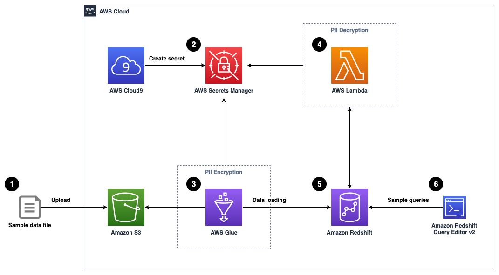

## Implement column-level encryption to protect sensitive data in Amazon Redshift with AWS Glue and AWS Lambda user-defined functions

## Introduction

This repository provides an [AWS CloudFormation](https://aws.amazon.com/cloudformation/) template that deploys a sample solution demonstrating how to implement your own column-level encryption mechanism in [Amazon Redshift](http://aws.amazon.com/redshift/) using [AWS Glue](https://aws.amazon.com/glue/) to encrypt sensitive data before loading data into Amazon Redshift, and using [AWS Lambda](http://aws.amazon.com/lambda/) as a [user-defined function](https://docs.aws.amazon.com/redshift/latest/dg/user-defined-functions.html) (UDF) in Amazon Redshift to decrypt the data using standard SQL statements. 

## Solution Overview


1.	We upload a sample data file [here](/data/pii-sample-dataset.csv) (generated with [Mockaroo](https://www.mockaroo.com/)) containing synthetic PII data to an [Amazon Simple Storage Service](http://aws.amazon.com/s3) (Amazon S3) bucket.
2.	A sample 256-bit data encryption key is generated and securely stored using [AWS Secrets Manager](https://aws.amazon.com/secrets-manager/).
3.	An AWS Glue job reads the data file from the S3 bucket, retrieves the data encryption key from Secrets Manager, performs data encryption for the PII columns, and loads the processed dataset into an Amazon Redshift table.
4.	We create a Lambda function to reference the same data encryption key from Secrets Manager, and implement data decryption logic for the received payload data.
5.	The Lambda function is registered as a [Lambda UDF](https://docs.aws.amazon.com/redshift/latest/dg/udf-creating-a-lambda-sql-udf.html) with a proper [AWS Identity and Access Management](http://aws.amazon.com/iam) (IAM) role that the Amazon Redshift cluster is authorized to assume.
6.	We can validate the data decryption functionality by issuing sample queries using [Amazon Redshift Query Editor v2.0](https://aws.amazon.com/redshift/query-editor-v2/). You may optionally choose to test it with your own SQL client or business intelligence tools.

## Deployment on AWS

1.	Sign in to your AWS account.
2.	Navigate to an AWS Region (for example, `us-east-2`).
3.	Download the CloudFormation template file [here](/cloudformation-template/ImplementRedshiftColumnLevelEncryption.yaml).
4.	Upload the CloudFormation template file in the [CloudFormation create stack page](https://console.aws.amazon.com/cloudformation/home#/stacks/create/template) to deploy the solution.
5.	Enter a name for the CloudFormation stack (for example, `aws-blog-redshift-column-level-encryption`).
6.	For **RedshiftMasterUsername**, enter a user name for the admin user account of the Amazon Redshift cluster or leave as default (`master`).
7.	For **RedshiftMasterUserPassword**, enter a strong password for the admin user account of the Amazon Redshift cluster. 
> Please note that the password should be between 8 and 64 characters in length, and contains at least one uppercase letter, at least one lowercase letter, and at least one number.


8.	Select **I acknowledge that AWS CloudFormation might create IAM resources** at the last step of stack creation.
9.	Choose **Create stack**.

The CloudFormation stack creation process takes around 5–10 minutes to complete.

## Implementation Guide

An Amazon S3 bucket is provisioned for you during the CloudFormation stack setup. You can find the corresponding S3 bucket URL from the CloudFormation stack output with the key `AmazonS3BucketForDataUpload`.


Click on the URL value to navigate to the S3 bucket created for sample data upload. To test the solution, you may upload the sample synthetic data [here](/data/pii-sample-dataset.csv).


Navigate to AWS Cloud9 [console](https://console.aws.amazon.com/cloud9/), or visit the URL obtained from the CloudFormation stack output with the key `AWSCloud9IDE`.


Create a new file in the AWS Cloud9 environment and enter the following code snippet:

```python
from cryptography.fernet import Fernet
import boto3
import base64

key = Fernet.generate_key()
client = boto3.client('secretsmanager')

response = client.create_secret(
    Name='data-encryption-key',
    SecretBinary=base64.urlsafe_b64decode(key)
)

print(response['ARN'])
```

Save the file with the filename `generate_secret.py` (or any desired name ending with **.py**).


Install the required packages and run the Python script via the following commands:

```
pip install --user boto3
pip install --user cryptography
python generate_secret.py
```

A single-node Amazon Redshift cluster is provisioned for you during the CloudFormation stack setup. Once the secret generation step is completed, navigate to Amazon Redshift [console](https://console.aws.amazon.com/redshift/) to connect to the Redshift cluster by choosing **Query in query editor v2** on the **Query data** drop-down menu.


To connect to the cluster, choose the cluster name and provide the required credentials according to your CloudFormation stack settings.


In the query editor, run the following DDL command to create a table named `pii_table`:

```SQL
CREATE TABLE pii_table(
  id BIGINT,
  full_name VARCHAR(50),
  gender VARCHAR(10),
  job_title VARCHAR(50),
  spoken_language VARCHAR(50),
  contact_phone_number VARCHAR(20),
  email_address VARCHAR(50),
  registered_credit_card VARCHAR(100)
);
```

We recommend using the smallest possible column size as a best practice, and you may need to modify these table definitions per your specific use case. Creating columns much larger than necessary will have an impact on the size of data tables and affect query performance.


The CloudFormation stack provisioned two AWS Glue data crawlers: one for the Amazon S3 data source and one for the Amazon Redshift data source. Navigate to the AWS Glue [console](https://console.aws.amazon.com/glue/) and choose **Crawlers** in the navigation pane. Select the crawler named **glue-s3-crawler**, then choose **Run crawler** to trigger the crawler job.


Similarly, select the crawler named **glue-redshift-crawler**, then choose **Run crawler**.


An AWS Glue job is provisioned for you as part of the CloudFormation stack setup, but the extract, transform, and load (ETL) script has not been created. We create and upload the ETL script to the **/glue-script** folder under the provisioned S3 bucket in order to run the AWS Glue job.

Navigate to AWS Cloud9 [console](https://console.aws.amazon.com/cloud9/), or visit the URL obtained from the CloudFormation stack output with the key `AWSCloud9IDE`.


Create a new file in the AWS Cloud9 environment and enter the following code snippet:

```Python
import sys
from awsglue.transforms import *
from awsglue.utils import getResolvedOptions
from pyspark.context import SparkContext
from awsglue.context import GlueContext
from awsglue.job import Job
from awsglue.dynamicframe import DynamicFrameCollection
from awsglue.dynamicframe import DynamicFrame

import boto3
import base64
import hashlib
from pyspark.sql.functions import udf, col
from pyspark.sql.types import StringType

args = getResolvedOptions(sys.argv, ["JOB_NAME", "SecretName", "InputTable"])
sc = SparkContext()
glueContext = GlueContext(sc)
spark = glueContext.spark_session
job = Job(glueContext)
job.init(args["JOB_NAME"], args)

# retrieve the data encryption key from Secrets Manager
secret_name = args["SecretName"]

sm_client = boto3.client('secretsmanager')
get_secret_value_response = sm_client.get_secret_value(SecretId = secret_name)
data_encryption_key = get_secret_value_response['SecretBinary']

# Create a key using SHA-256 to ensure it's exactly 32 bytes for AES-256
key_hash = hashlib.sha256(data_encryption_key).digest()

# Broadcast the key hash so it's available to all executors
key_hash_broadcast = sc.broadcast(key_hash)

# define the data encryption function
def pii_encrypt(value):
    if value is None:
        value = ""
        
    # Import the cryptography library inside the function
    from cryptography.hazmat.primitives.ciphers.aead import AESGCM
    
    # Convert to bytes if not already
    plaintext = value.encode('utf-8')
    
    # Use the broadcasted key
    key = key_hash_broadcast.value
    aesgcm = AESGCM(key)
    
    # Generate a deterministic nonce based on the value
    # Using a hash of the value ensures the same nonce for the same input
    # Note: In production, carefully consider the security implications of this approach
    nonce = hashlib.sha256(plaintext).digest()[:12]  # AES-GCM requires a 12-byte nonce
    
    # No additional authenticated data (None)
    encrypted_bytes = aesgcm.encrypt(nonce, plaintext, None)
    
    # Return as base64 string
    return base64.b64encode(nonce + encrypted_bytes).decode('utf-8')
    
# register the data encryption function as Spark SQL UDF   
udf_pii_encrypt = udf(lambda z: pii_encrypt(z), StringType())

# define the Glue Custom Transform function
def Encrypt_PII (glueContext, dfc) -> DynamicFrameCollection:
    newdf = dfc.select(list(dfc.keys())[0]).toDF()
    
    # PII fields to be encrypted
    pii_col_list = ["registered_credit_card"]

    for pii_col_name in pii_col_list:
        newdf = newdf.withColumn(pii_col_name, udf_pii_encrypt(col(pii_col_name)))

    encrypteddyc = DynamicFrame.fromDF(newdf, glueContext, "encrypted_data")
    return (DynamicFrameCollection({"CustomTransform0": encrypteddyc}, glueContext))

# Script generated for node S3 bucket
S3bucket_node1 = glueContext.create_dynamic_frame.from_catalog(
    database="demodb",
    table_name=args["InputTable"],
    transformation_ctx="S3bucket_node1",
)

# Script generated for node ApplyMapping
ApplyMapping_node2 = ApplyMapping.apply(
    frame=S3bucket_node1,
    mappings=[
        ("id", "long", "id", "long"),
        ("full_name", "string", "full_name", "string"),
        ("gender", "string", "gender", "string"),
        ("job_title", "string", "job_title", "string"),
        ("spoken_language", "string", "spoken_language", "string"),
        ("contact_phone_number", "string", "contact_phone_number", "string"),
        ("email_address", "string", "email_address", "string"),
        ("registered_credit_card", "long", "registered_credit_card", "string"),
    ],
    transformation_ctx="ApplyMapping_node2",
)

# Custom Transform
Customtransform_node = Encrypt_PII(glueContext, DynamicFrameCollection({"ApplyMapping_node2": ApplyMapping_node2}, glueContext))

# Script generated for node Redshift Cluster
RedshiftCluster_node3 = glueContext.write_dynamic_frame.from_catalog(
    frame=Customtransform_node,
    database="demodb",
    table_name="demodb_public_pii_table",
    redshift_tmp_dir=args["TempDir"],
    transformation_ctx="RedshiftCluster_node3",
)

job.commit()
```

Save the script with the file name `pii-data-encryption.py`.


Copy the script to the desired S3 bucket location by running the following command:

```
S3_BUCKET=$(aws s3 ls| awk '{print $3}'| grep awsblog-pii-data-input-)
aws s3 cp pii-data-encryption.py s3://$S3_BUCKET/glue-script/pii-data-encryption.py
```

To verify the script is uploaded successfully, navigate to the **Jobs** page on the AWS Glue Studio [console](https://console.aws.amazon.com/gluestudio/).

You should be able to find a job named **pii-data-encryption-job**, then choose **Run** to trigger the AWS Glue job.


Navigate back to the Amazon Redshift Query Editor V2 to register a Lambda UDF. Use the `CREATE EXTERNAL FUNCTION` command and provide an IAM role that the Amazon Redshift cluster is authorized to assume and make calls to Lambda:

> Remember to replace the placeholders (**<--Replace-with-your-lambda-function-name-->** and **<--Replace-with-your-redshift-lambda-iam-role-arn-->**) using the CloudFormation stack output values (`LambdaFunctionName` and `IAMRoleForRedshiftLambdaUDF`)

```SQL
CREATE OR REPLACE EXTERNAL FUNCTION pii_decrypt (value varchar(max))
RETURNS varchar STABLE
LAMBDA '<--Replace-with-your-lambda-function-name-->'
IAM_ROLE '<--Replace-with-your-redshift-lambda-iam-role-arn-->';
```


By default, permission to run new Lambda UDFs is granted to PUBLIC. To restrict usage of the newly created UDF, revoke the permission from PUBLIC and then grant the privilege to specific users or groups. You must be a `superuser` or have the `sys:secadmin` role to run the following SQL statements:

```SQL
GRANT SELECT ON "demodb"."public"."pii_table" TO PUBLIC;
CREATE USER regular_user WITH PASSWORD '1234Test!';
CREATE USER privileged_user WITH PASSWORD '1234Test!';
REVOKE EXECUTE ON FUNCTION pii_decrypt(varchar) FROM PUBLIC;
GRANT EXECUTE ON FUNCTION pii_decrypt(varchar) TO privileged_user;
```

First, we may run a SELECT statement to verify that our highly sensitive data field, in this case the `registered_credit_card` column, is now encrypted in the Amazon Redshift table:

```SQL
SELECT * FROM "demodb"."public"."pii_table";
```


For regular database users who have not been granted the permission to use the Lambda UDF, they will see a permission denied error when they try to use the `pii_decrypt()` function:

```SQL
SET SESSION AUTHORIZATION regular_user;
SELECT *, pii_decrypt(registered_credit_card) AS decrypted_credit_card FROM "demodb"."public"."pii_table";
```


For privileged database users who have been granted the permission to use the Lambda UDF for decrypting the data, they can issue a SQL statement using the `pii_decrypt()` function:

```SQL
SET SESSION AUTHORIZATION privileged_user;
SELECT *, pii_decrypt(registered_credit_card) AS decrypted_credit_card FROM "demodb"."public"."pii_table";
```


The original `registered_credit_card` values can be successfully retrieved, as shown in the `decrypted_credit_card` column.

## Cleaning Up

To avoid incurring future charges, make sure to clean up all the AWS resources that you created.

You can delete the CloudFormation stack on the AWS CloudFormation [console](https://console.aws.amazon.com/cloudformation/) or via the [AWS Command Line Interface](http://aws.amazon.com/cli) (AWS CLI). The default stack name in this sample solution is `aws-blog-redshift-column-level-encryption`.

## Security

See [CONTRIBUTING](CONTRIBUTING.md#security-issue-notifications) for more information.

## License

This library is licensed under the MIT-0 License. See the [LICENSE](LICENSE) file.
